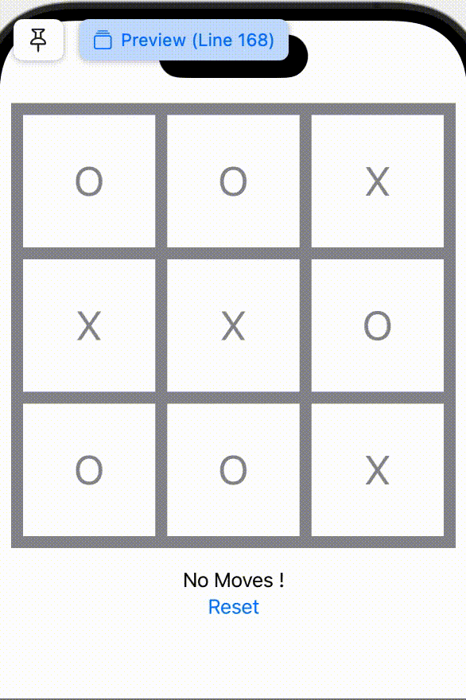
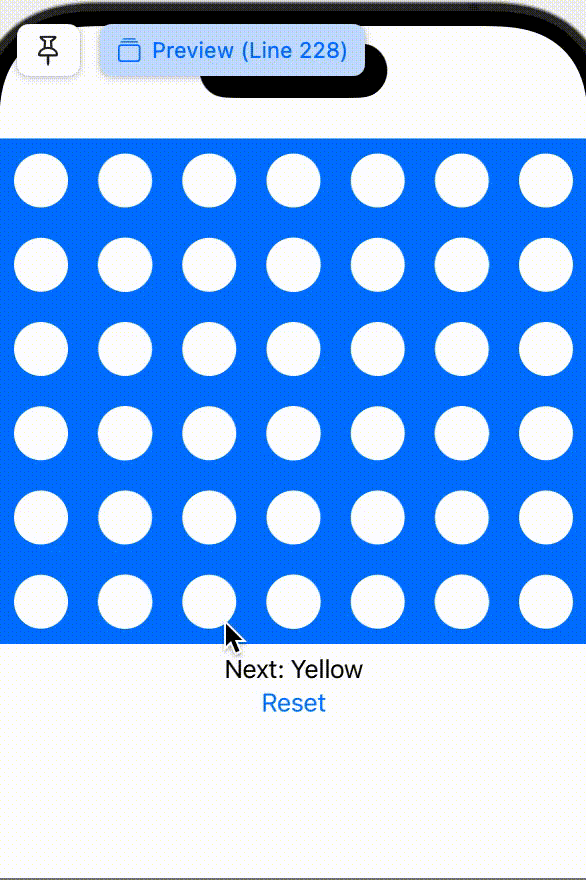

# SimpleGames
SwiftUI preview for simple kid games: explanation of rules and demo are below

## Tic-Tac-Toe
With a grid of customized dimension (between 3-6), two players take turns to fill in "O" or "X" to board, until one player fill a row, or a column, or a diagnal line will all its symbols.

## Connect-Four
With a grid of 6x7, two players take turns to drop yellow or red circle to selected column, until one player connect four grid of the same color.

