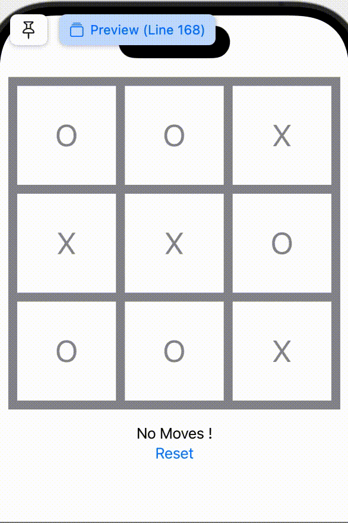
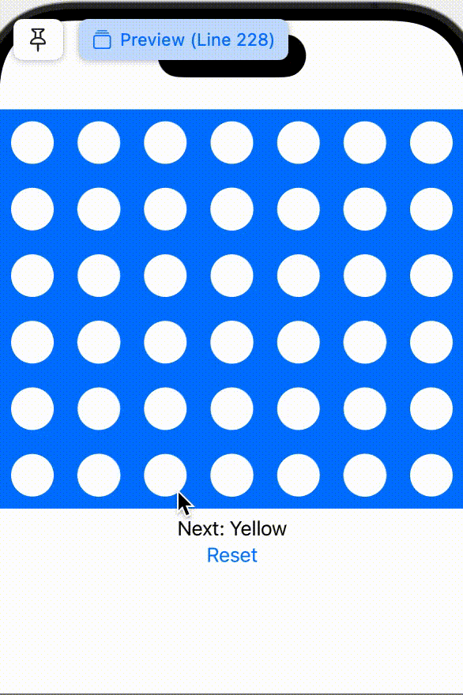
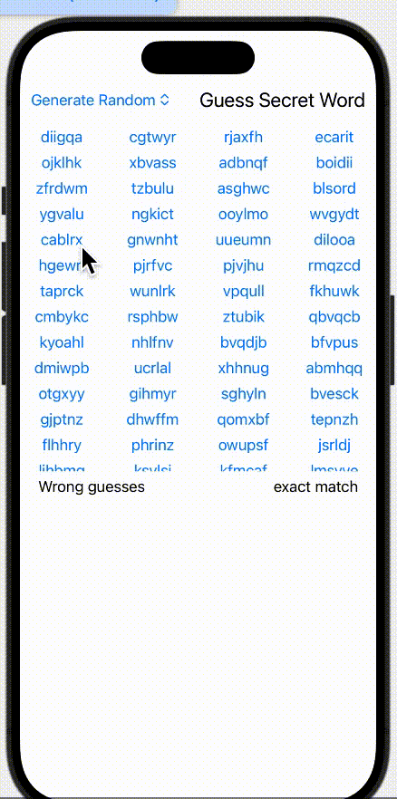
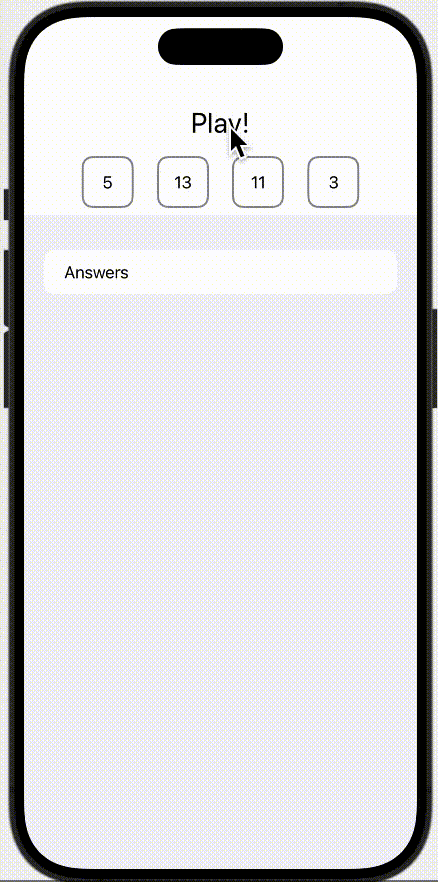
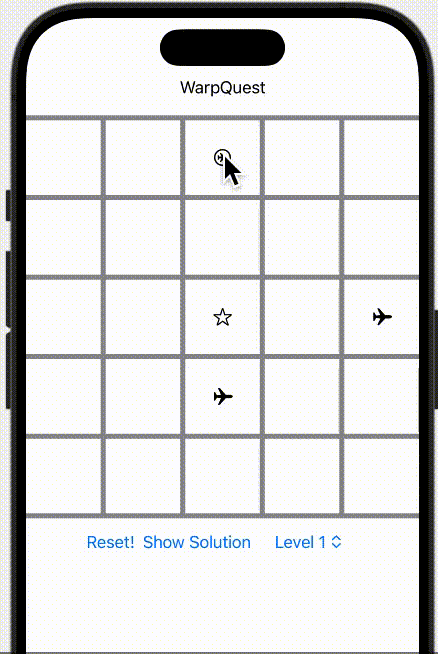

# SimpleGames
SwiftUI preview for simple kid games: explanation of rules and demo are below

## Tic-Tac-Toe
With a grid of customized dimension (between 3-6), two players take turns to fill in "O" or "X" to board, until one player fill a row, or a column, or a diagnal line will all its symbols.

## Connect-Four
With a grid of 6x7, two players take turns to drop yellow or red circle to selected column, until one player connect four grid of the same color.

## Guess-Six-Letter-Words
Given a list of words (length of 6), player tries to guess the one "secret" word within it. Each wrong guess return a "exact match" number, which means how many characters match with the "secret" at the exact position. Try to mimimize the number of guesses.

## 24-Points (Poker Games) 
Random withdraw 4 cards from a deck of poker cards (excluding jokers), come up with a variaty of ways to make equations by adding "+", "-", "*", "/" which result in 24.
Parenthesis can be inserted as well. I haven't come up a very good way to deduplicate equations. Welcome to share your thoughts！

## Warp-Quest
Rewrite an [old game](https://github.com/barbie6676/WarpQuestSolution) with interactable visualization. Given a 5x5 grid, move the target plane (one with a circle) to the destination (star) to unblock next level (18 levels in total). The each plane can be moved horitonzally or vertically towards another plane, if there is no stones (no-entry) in between the route. 

